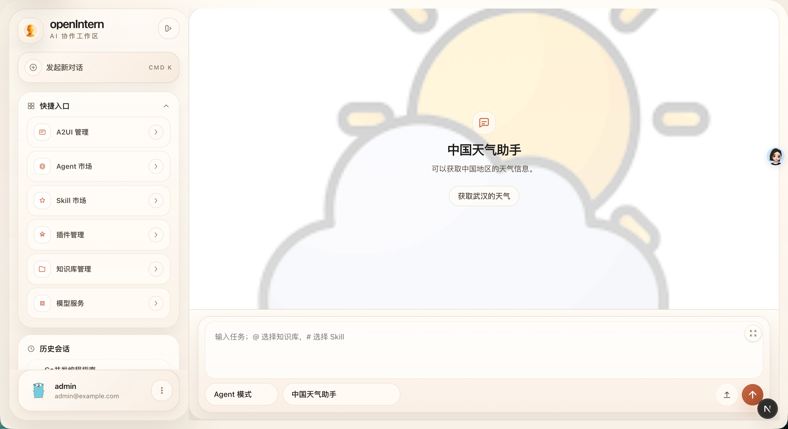
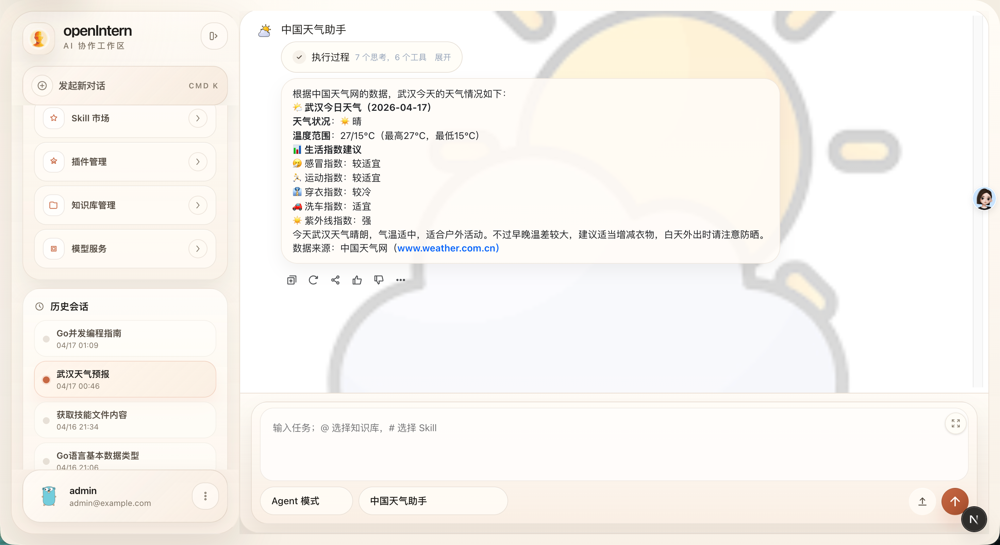
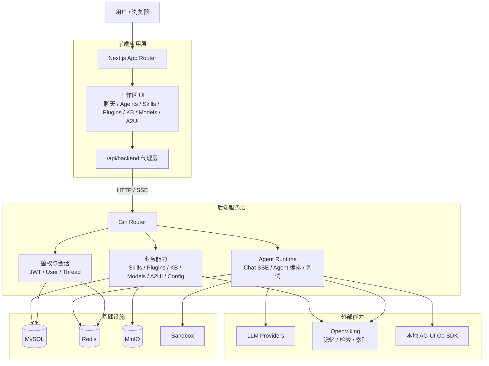

# openIntern

<div align="center">
  <h1>openIntern</h1>
  <p><strong>面向 AI 协作场景的一体化工作区</strong></p>
  <p>支持聊天、Agent 编排、技能管理、插件接入、知识库检索、模型服务配置、A2UI 管理与长期记忆能力。</p>
</div>

<p align="center">
  
  
  
  
  
  
  
</p>

## 项目简介

`openIntern` 是一个围绕 AI Agent 工作流搭建的全栈项目，目标不是只做一个聊天页面，而是把 **Agent 配置、工具接入、知识沉淀、模型管理和运行时调试** 放进同一个工作区里。

从当前代码结构看，项目已经具备这些核心能力：

- 聊天与 SSE 流式响应
- Agent 创建、编辑、启停、调试与子 Agent 编排
- Skill 导入、元数据管理与内容查看
- Plugin 管理、代码调试与启停同步
- Knowledge Base 导入、目录浏览、索引状态刷新与内容检索
- 模型提供商、模型目录与默认模型配置
- A2UI 资源管理
- 基于 OpenViking 的长期记忆 / 知识检索能力
- Sandbox、对象存储、用户信息与会话历史管理

## 界面预览

<table>
  <tr>
    <td width="50%">
      
    </td>
    <td width="50%">
      
    </td>
  </tr>
  <tr>
    <td width="50%">
      
    </td>
    <td width="50%">
      
    </td>
  </tr>
  <tr>
    <td width="50%">
      
    </td>
    <td width="50%">
      
    </td>
  </tr>
</table>

## 技术架构



## 仓库结构

```text
openIntern/
├── README.md
├── compose.yaml                    # 本地依赖服务：MySQL / Redis / MinIO / OpenViking
├── go/                             # 本地 AG-UI Go SDK（后端 go.mod 通过 replace 引用）
├── images/                         # README 与文档截图
├── scripts/                        # 项目脚本
├── docs/                           # 补充文档
├── dependent_docs/                 # 依赖相关资料
├── 开发文档/                        # 设计与实现文档（可能与代码现状不完全一致）
├── openIntern_backend/             # Go 后端
│   ├── main.go
│   ├── config.yaml
│   ├── ov.conf / ov.conf.example
│   └── internal/
└── openIntern_forentend/           # Next.js 前端（按仓库现状保留 forentend 拼写）
    ├── app/
    ├── package.json
    ├── pnpm-lock.yaml
    └── .env.local
```

## 核心模块

| 模块 | 说明 |
| --- | --- |
| Chat | `/v1/chat/sse` 提供流式对话；前端工作区默认入口为 `/chat` |
| Agent | 支持 Single Agent / Supervisor Agent、模型绑定、技能/知识库/子 Agent 绑定、调试会话 |
| Skills | 支持技能导入、元数据管理、内容查看与详情页展示 |
| Plugins | 支持插件创建、详情编辑、启停、同步以及代码插件调试 |
| Knowledge Base | 支持导入、树结构浏览、内容查看、索引状态追踪 |
| Models | 支持模型提供商管理、模型目录管理、默认模型设置 |
| A2UI | 支持 A2UI 资源创建、查询、更新与删除 |
| Memory | 接入 OpenViking，为长期记忆和知识检索提供基础能力 |
| Storage | MinIO 负责头像、资源文件与对象资产访问 |

## 开发环境要求

建议本地准备以下环境：

- `Go 1.25.5`
- `Node.js 22+`
- `pnpm`
- `Docker` 与 `Docker Compose`

本地依赖服务由根目录 `compose.yaml` 提供：

- `MySQL 8.4`
- `Redis 7.4`
- `MinIO`
- `OpenViking`

## 快速启动

### 1. 启动基础依赖

在仓库根目录执行：

```bash
docker compose up -d mysql redis minio openviking
```

默认会拉起这些端口：

- `3306`：MySQL
- `6379`：Redis
- `9000`：MinIO API
- `9001`：MinIO Console
- `1933`：OpenViking Health / API
- `8020`：OpenViking 额外暴露端口

### 2. 配置后端

后端默认读取：

- `openIntern_backend/config.yaml`
- `openIntern_backend/ov.conf`

你至少需要检查这些配置是否和本地环境一致：

| 配置项 | 用途 |
| --- | --- |
| `port` | 后端服务监听端口 |
| `mysql.dsn` | MySQL 连接串 |
| `redis.*` | Redis 连接信息 |
| `jwt.secret` | 登录鉴权密钥 |
| `minio.*` | 对象存储配置 |
| `summary_llm.*` | 总结模型配置 |
| `tools.openviking.*` | OpenViking 地址、密钥、技能根目录 |
| `tools.sandbox.*` | Sandbox 提供方与 Docker 运行配置 |
| `plugin.*` | 内置插件清单与默认图标等配置 |

> 注意：`config.yaml` 与 `.env.local` 中的密钥、凭证禁止提交到仓库。

### 3. 启动后端

```bash
cd openIntern_backend
go run .
```

默认情况下，前端本地开发代理使用的是 `http://localhost:8080`。如果你修改了后端端口，需要同步更新前端环境变量。

### 4. 配置前端

前端本地环境变量文件：

- `openIntern_forentend/.env.local`

当前代码默认通过 Next Route Handler 把 `/api/backend/*` 转发到 `API_BASE_URL`，本地开发可参考：

```bash
API_BASE_URL=http://localhost:8080
```

### 5. 启动前端

```bash
cd openIntern_forentend
pnpm dev
```

启动后访问：

- 前端工作区：[http://localhost:3000](http://localhost:3000)
- 后端接口基地址：[http://localhost:8080](http://localhost:8080)

## 常用开发命令

### 后端

```bash
cd openIntern_backend
go run .
```

### 前端

```bash
cd openIntern_forentend
pnpm dev
pnpm build
pnpm start
```

### 依赖服务

```bash
docker compose up -d
docker compose ps
docker compose logs -f openviking
```

## 前后端联调说明

- 浏览器请求 `/api/backend/*` 时，会由 Next.js 转发到 `API_BASE_URL`
- 默认登录接口为 `/api/backend/v1/auth/login`
- 默认注册接口为 `/api/backend/v1/auth/register`
- 聊天走 `/api/backend/v1/chat/sse`
- 静态资源通过后端 `/v1/assets/*objectKey` 提供

这意味着：

1. 前端不需要直接写死后端域名到各个页面组件里。
2. 本地与部署环境只需要调整 `API_BASE_URL`。
3. 如果出现“前端能打开但接口全部 500”，优先检查 `.env.local` 里的 `API_BASE_URL`。

## 主要接口分组

后端当前路由已经按业务拆分为以下分组：

- `/v1/auth`
- `/v1/users`
- `/v1/chat`
- `/v1/threads`
- `/v1/agents`
- `/v1/skills`
- `/v1/plugins`
- `/v1/kbs`
- `/v1/model-providers`
- `/v1/models`
- `/v1/a2uis`
- `/v1/config`

## 运行依赖说明

### OpenViking

项目已在 `compose.yaml` 中集成 `openviking` 服务，并挂载：

- `./scripts/openviking-console-entrypoint.sh`
- `./openIntern_backend/ov.conf`

如果你需要重新初始化配置，可参考：

- `openIntern_backend/ov.conf.example`

### 本地 AG-UI Go SDK

后端 `go.mod` 当前通过 `replace` 将 AG-UI Go SDK 指向仓库内的 `go/` 目录。

这意味着：

- 开发时会直接使用仓库里的本地 SDK 实现，而不是远端模块版本
- 如果你在另一台机器上重新克隆仓库，需要检查 `go.mod` 里的本地 `replace` 路径是否仍然有效

## 常见问题

### 1. 前端登录页能打开，但接口请求失败

优先检查：

- 后端是否已经启动
- `openIntern_forentend/.env.local` 中的 `API_BASE_URL` 是否正确
- 后端 `config.yaml` 中端口是否与前端代理地址一致

### 2. 知识库 / 长期记忆不可用

优先检查：

- `openviking` 容器是否健康
- `openIntern_backend/ov.conf` 是否正确挂载
- `tools.openviking` 配置是否完整

### 3. 图片或头像访问异常

优先检查：

- `minio` 是否启动
- `minio.public_base_url` 是否与当前访问方式匹配
- 对象 key 是否能通过 `/v1/assets/*objectKey` 正常访问

## 适合继续补充的内容

如果后续还要继续完善 README，建议优先补这些：

- 增加 `config.yaml.example`
- 增加完整的初始化 SQL 或自动迁移说明
- 增加部署方式说明
- 增加插件 / Skill 编写指南
- 增加 API 文档入口或 OpenAPI 描述

## License

本项目采用 [MIT License](./LICENSE)。

这意味着你可以在保留版权声明与许可证文本的前提下：

- 使用
- 复制
- 修改
- 分发
- 商业使用

许可证全文见根目录 [LICENSE](/Users/fqc/project/agent/openIntern/LICENSE)。
