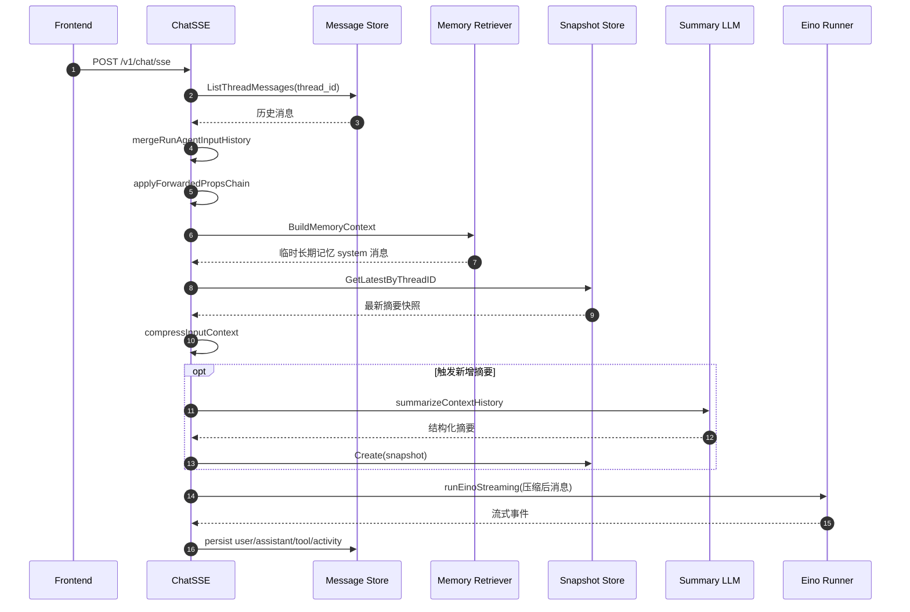

# 上下文压缩链路梳理

## 结论先行

当前项目里的“上下文压缩”是后端 `RunAgent` 主链中的一个运行时步骤，不是前端能力，也不是独立异步任务。它的核心目标不是改写历史消息表，而是在真正调用模型之前，把已经组装好的上下文裁到可控预算内，并在需要时生成线程级摘要快照，供下一轮继续复用。

这条链路当前已经形成闭环：

- 启动时读取 `context_compression` 配置，并初始化摘要模型。
- 每轮聊天先从 MySQL 取历史消息，再叠加 forwarded props 注入出的知识库/技能上下文，以及长期记忆检索结果。
- 在进入 Eino Runner 之前，根据软硬阈值和模型上下文窗口执行压缩。
- 被移除的历史消息会在必要时合并进线程级摘要，并持久化到 `thread_context_snapshot`。
- 下一轮再次进入压缩逻辑时，会先读最近一次摘要快照，避免已经被摘要覆盖的旧消息重新进入最近窗口。

需要明确几个边界：

- 上下文压缩只作用于“本轮发给模型的输入消息列表”，不会直接修改 `message` 表里的历史原文。
- 长期记忆注入发生在压缩之前，因此长期记忆也会参与预算竞争。
- forwarded props 注入出的知识库结果和技能约束，也是在压缩之前拼进 prompt。
- 摘要快照是线程级滚动状态，不等同于 OpenViking 长期记忆。
- 摘要生成失败不会中断本轮聊天；真正会中断请求的是“压缩后仍超过 hard limit”。

## 参与模块

### 请求入口

- `openIntern_backend/internal/controllers/chat.go`
- `openIntern_backend/internal/services/agent.go`
- `openIntern_backend/internal/services/agent/agent_entry.go`

### 压缩核心

- `openIntern_backend/internal/services/agent/context_compression.go`
- `openIntern_backend/internal/services/agent/context_summary.go`
- `openIntern_backend/internal/services/agent/agent_forwarded_props.go`
- `openIntern_backend/internal/services/agent/memory_retriever.go`

### 配置与初始化

- `openIntern_backend/internal/config/config.go`
- `openIntern_backend/internal/services/agent/agent_init.go`
- `openIntern_backend/main.go`

### 摘要快照持久化

- `openIntern_backend/internal/models/thread_context_snapshot.go`
- `openIntern_backend/internal/services/thread_context_snapshot.go`
- `openIntern_backend/internal/dao/thread_context_snapshot.go`
- `openIntern_backend/internal/database/database.go`

## 启动期初始化

后端启动时，和上下文压缩相关的初始化主要有两步：

- `main.go` 调用 `services.InitEino(cfg.LLM, cfg.SummaryLLM, cfg.Tools, cfg.ContextCompression, cfg.APMPlus)`。
- `InitEino(...)` 内部把 `context_compression` 转成运行时参数，并把 `summary_llm` 初始化成一个 `deepseek.ChatModel`，存进 `runtimeState.titleModel`。

这里有一个实现细节需要特别记住：

- `summary_llm` 当前并不是只给“线程标题生成”使用。
- 同一个 `titleModel` 同时被 `ensureThreadTitle(...)` 和 `summarizeContextHistory(...)` 复用。
- 如果 `summary_llm` 没配置，标题生成和上下文摘要都会退化为“尽量不依赖模型”的路径。

## 输入组装阶段

### SSE 请求进入后端

入口是 `POST /v1/chat/sse`：

1. `controllers.ChatSSE` 绑定 `types.RunAgentInput`。
2. 如果前端没传 `thread_id`，后端会生成一个。
3. 校验用户身份并确保线程存在。
4. 调 `services.RunAgent(...)` 进入真正执行链路。

前端在这条链路里没有上下文压缩逻辑。前端只负责发送本轮输入和线程号，压缩完全在服务端完成。

### 历史消息合并

`RunAgent(...)` 的第一段逻辑是从 `message` 表回放历史：

1. `MessageStore.ListThreadMessages(threadID)` 读取当前线程全部消息，按 `created_at asc` 排序。
2. `mergeRunAgentInputHistory(...)` 只把 `type == "text"` 的消息并回上下文。
3. 当前请求里最后一条 user 消息会被再次附加到 `merged.Messages` 末尾，形成“历史 + 本轮最后一个用户输入”的视图。

这意味着压缩模块面对的不是前端上传的原始请求，而是服务端补全后的连续会话上下文。

### Forwarded Props 注入

历史消息合并后，会先跑 `applyForwardedPropsChain(...)`。这一层本身不做压缩，但会扩大待压缩上下文：

- `a2uiAction` 会转成一条追加的 user 消息。
- `agentConfig` 会解析出运行时模型、插件和搜索参数。
- `contextSelections` 会把知识库检索结果插成一条临时 system 消息，把技能约束插成一条临时 user 消息。

知识库和技能消息都插在最后一条 user 消息之前，因此它们会和真实用户提问一起参与后面的预算计算。

### 长期记忆注入

`applyForwardedPropsChain(...)` 之后，`RunAgent(...)` 会调用 `injectRetrievedMemoryContext(...)`：

1. 取最后一条 user 文本作为长期记忆检索 query。
2. 由 `services.MemoryRetriever.BuildMemoryContext(...)` 构造一条临时 system 消息。
3. 这条消息同样被插入到最后一条 user 消息之前。

因此在真正开始压缩之前，输入消息列表的典型顺序已经变成：

- 历史 system 消息
- 历史 user/assistant 消息
- 知识库临时消息（如果有）
- 技能约束临时消息（如果有）
- 长期记忆临时消息（如果有）
- 本轮最后一条 user 消息

## 压缩触发阶段

### 触发位置

上下文压缩发生在 `RunAgent(...)` 里的这个位置：

- 先 `injectRetrievedMemoryContext(...)`
- 再 `compressInputContext(...)`
- 再 `AGUIRunInputToEinoMessages(...)`
- 最后才会进入 `runEinoStreaming(...)`

也就是说，压缩发生在“所有候选上下文已经组装完成，但还没转换成 Eino Message”这个时间点。

### 预算来源

`compressInputContext(...)` 会先构建 `contextCompressionBudget`，预算来源有两层：

- 基础配置来自 `config.yaml` 里的 `context_compression`
- 如果 runtime model 能解析出 `CapabilitiesJSON` 中的 `context_window` / `max_input_tokens`，会再按模型窗口收紧 `hard_limit`

最终预算字段是：

- `soft_limit_tokens`
- `hard_limit_tokens`
- `output_reserve_tokens`
- `context_window_tokens`

默认规则是：

- 没配 `hard_limit_tokens` 时，用 `12000`
- 没配 `output_reserve_tokens` 时，用 `2048`
- `soft_limit_tokens` 缺失或不合法时，取 `hard_limit` 的 85%

### 触发条件

压缩逻辑先用一个非常粗粒度的估算器计算消息 token：

- 估算方式是 `len(role + content) / estimated_chars_per_token`
- 默认 `estimated_chars_per_token = 4`

如果所有消息估算 token 总和没有超过 `soft_limit_tokens`，本轮直接跳过压缩。

只有当估算值超过 `soft_limit_tokens` 时，`stats.Triggered` 才会变成 `true`，后续裁剪和摘要逻辑才会执行。

## 压缩执行阶段

### 先读取最近一次摘要快照

压缩开始后，服务会先调用 `loadLatestThreadContextSnapshot(threadID)` 取当前线程最近的一条快照。

快照里最重要的字段有三个：

- `compression_index`
- `covered_until_msg_id`
- `summary_text`

其中 `covered_until_msg_id` 的作用非常关键：

- 如果某条历史消息及其之前的区间已经被上一份摘要覆盖，那么这些消息不会再被当作“最近窗口候选”重复保留。
- 这样可以避免出现“旧原文 + 旧摘要”同时进入 prompt 的重复堆积。

### 保留规则

当前压缩器不是通用重排器，而是一个比较明确的保留策略：

- 所有 `system` 消息默认固定保留。
- 最后一条 user 消息固定保留。
- 从尾部开始，额外保留最近 `max_recent_messages` 条消息。
- 读取到已有快照时，`covered_until_msg_id` 之前的消息不会再被纳入最近窗口计数。

默认 `max_recent_messages = 14`。

### 二次裁剪

即使完成了“固定保留 + 最近窗口保留”，仍然可能超过 `hard_limit_tokens`。这时还会做一次二次裁剪：

- 只从“最近窗口里保留的、但不是 pinned 的消息”中继续删除。
- 删除顺序是从更早的保留消息开始删。
- `system` 消息和最后一条 user 消息不会在这个阶段被删掉。

如果走到这一步后，`keptTokens` 仍然大于 `hard_limit_tokens`，函数会直接返回错误，整轮请求失败，不会用“兼容错误”的方式继续往下跑。

## 摘要生成与快照持久化

### 哪些消息会进入摘要增量

并不是所有被删掉的消息都会拿去总结。当前实现只会收集：

- 本轮没有被保留的消息
- 并且消息索引在 `covered_until_msg_id` 之后

这意味着：

- 已经被旧摘要覆盖过的区间不会被反复摘要。
- 新增被压缩掉的历史才会进入本轮增量摘要。

### 摘要格式

`summarizeContextHistory(...)` 定义了一套稳定的结构化 payload：

- `user_intent`
- `decisions`
- `constraints`
- `open_tasks`
- `facts`
- `do_not_repeat`

模型返回后会被解析为 `contextSummaryPayload`，再渲染成稳定文本格式，类似：

```text
UserIntent: ...

Decisions:
- ...

Constraints:
- ...
```

随后又会再包装成一条 system 消息，前缀固定为：

`以下是历史对话压缩摘要，仅用于保持上下文连续性，请在回答时优先遵守其中的约束和已确认结论：`

### 摘要模型与降级路径

摘要生成分两种路径：

- 配了 `summary_llm` 时，调用模型输出 JSON，再做结构化清洗。
- 没配模型时，走 `buildFallbackSummary(...)`，把旧摘要和本轮增量文本做一个保守拼接。

还有一个很重要的实现行为：

- `buildAndPersistThreadSummary(...)` 即使失败，`compressInputContext(...)` 也不会直接报错。
- 当前代码只在 `err == nil` 时更新 `summaryText` 和 `snapshotIndex`。
- 这意味着摘要生成/落库失败只会让本轮失去“摘要增量更新”，不会直接打断聊天。

### 快照何时落库

只有在这些条件满足时，才会新建一条 `thread_context_snapshot`：

- `thread_id` 不为空
- 本轮最终得到了非空 `summary_text`
- 且存在新增被压缩的消息

落库内容包括：

- `thread_id`
- `compression_index`
- `covered_until_msg_id`
- `summary_text`
- `summary_struct_json`
- `approx_tokens`

`compression_index` 是递增的：

- 没有旧快照时，从 `1` 开始
- 有旧快照时，用 `previous.compression_index + 1`

`covered_until_msg_id` 记录的是“本轮被压缩消息里的最后一条消息 ID”，用于下轮判断旧区间是否已经被摘要覆盖。

### 摘要回填到 prompt 的条件

即使本轮没有新增被删消息，只要线程上已经存在 `summary_text`，压缩器仍然可能把摘要回填到 prompt。

不过摘要消息并不是必定插入，插入前还会再做一次预算判断：

- 先估算摘要 system 消息的 token
- 只有 `keptTokens + summaryCost <= hard_limit` 时，才会真正插入

插入位置也有明确规则：

- 摘要消息会被插入到现有所有 system 消息之后
- 也就是位于“system 段尾部、普通历史消息之前”

## 模型执行与落库阶段

压缩后的 `RunAgentInput` 会被转成 Eino Message，然后进入 `runEinoStreaming(...)`。

这里要注意：

- 真正送给模型的是压缩后的消息序列，不是原始历史全量。
- 但聊天结束后持久化到 `message` 表的，仍然是本轮真实 user 消息和流式产出的 assistant/tool/activity 消息。
- 压缩后的 prompt 不会整体落成一条“压缩版会话”消息。

所以这个链路的持久化分成两类：

- `message` 表保存原始会话事实
- `thread_context_snapshot` 表保存滚动摘要状态

## 时序图



## 失败与降级行为

当前实现下，不同阶段的失败处理方式并不相同：

- 历史消息加载失败：直接中断请求。
- forwarded props 处理失败：直接中断请求。
- 长期记忆检索失败：记录日志，退回不带记忆的输入继续执行。
- 上下文压缩后仍超过 `hard_limit`：直接中断请求。
- 摘要生成失败或摘要快照落库失败：忽略本轮摘要更新，继续执行模型调用。

这也是当前链路里最重要的鲁棒性设计之一：真正影响模型可执行性的错误必须显式失败，摘要增强失败则只做能力降级。

## 和长期记忆链路的关系

当前项目里，“上下文压缩”和“长期记忆”是相邻但分离的两条链路：

- 长期记忆负责在聊天前给 prompt 补一条临时 system 记忆消息。
- 上下文压缩负责把“历史消息 + 知识库上下文 + 技能约束 + 长期记忆 + 当前用户消息”一起压到预算内。

所以它们的关系不是二选一，而是前后串联：

1. 先检索长期记忆
2. 再统一压缩总上下文
3. 再进入模型

## 当前实现的几个关键特征

- 压缩器使用的是“估算 token + 保留规则 + 线程滚动摘要”组合，不依赖 tokenizer 精确计数。
- 所有 `system` 消息都会被固定保留，所以知识库、长期记忆、历史 system 指令都有较高优先级。
- `summary_llm` 目前同时承担“标题生成”和“摘要生成”两个职责。
- 摘要快照是追加写，不会覆盖旧快照；读取时只取最新一条。
- 压缩的结果只影响模型输入，不会改写历史原文存储。

## 可以继续关注的风险点

- 当前 `system` 消息全部固定保留，如果知识库/长期记忆/system 指令堆积过多，可能让非 pinned 历史几乎没有生存空间。
- token 估算采用字符数近似，适合做保守限流，但不适合拿来做精确计费或精细排序。
- 摘要生成和标题生成共用同一个 `summary_llm`，如果后续这两个任务在质量或时延上的要求分化，可能需要拆开配置。
- 摘要快照创建失败目前不会告警升级，只会静默退化为“没有增量摘要更新”。
