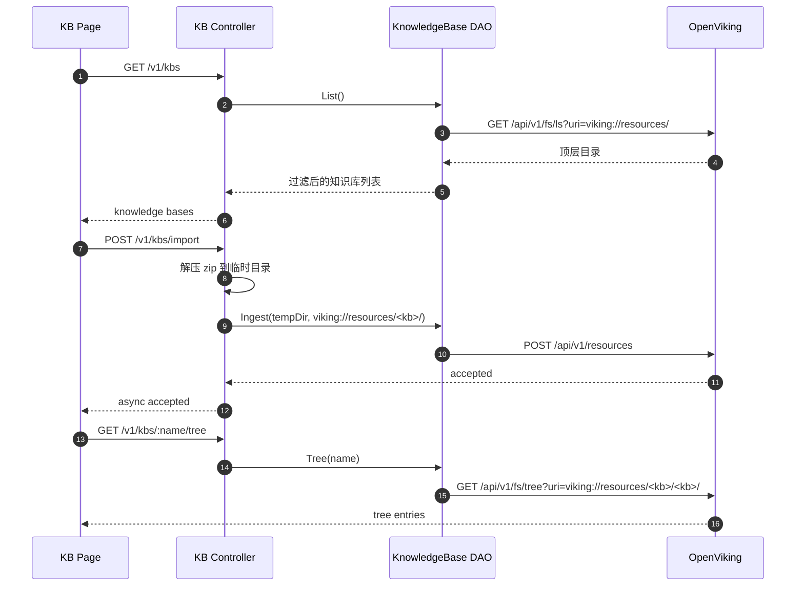
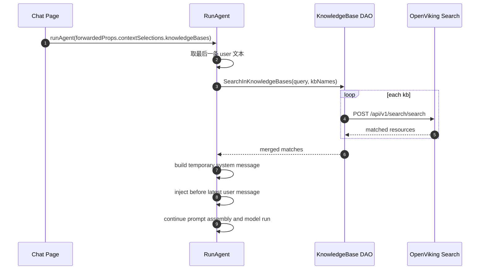

# 知识库管理链路梳理

## 结论先行

当前项目里的“知识库”能力，本质上是 **OpenViking resources 的一层业务封装**，不是前端本地文件树，也不是后端 MySQL 里的独立知识库表。它分成两条主链：

1. 管理链路：前端知识库管理页调用后端 `/v1/kbs/*`，后端再把操作转成 OpenViking 的文件系统/资源导入接口。
2. 使用链路：聊天页通过 `@知识库` 选择目标知识库，后端在 `RunAgent` 里按最后一条 user 消息做检索，再把命中结果拼成一条临时 `system` 消息注入模型上下文。

需要先明确几个边界：

- 知识库目录本体存放在 OpenViking `viking://resources/` 下，不落 MySQL。
- “创建知识库”不是建数据库记录，而是把一个空目录或 zip 解压后的目录导入到 OpenViking。
- 前端知识库管理页只做列表、树、上传、拖拽移动、删除，不直接做语义检索。
- 聊天阶段也不是把整库内容灌给模型，而是基于当前问题执行检索后，注入命中的摘要文本。
- 当前知识库管理链路和长期记忆链路是分开的；它们都依赖 OpenViking，但 URI 空间和调用接口不同。

## 参与模块

### 前端

- `openIntern_forentend/app/(workspace)/kb/page.tsx`
- 知识库管理页：列表、文件树、zip 初始化、文件上传、拖拽移动、删除。
- `openIntern_forentend/app/(workspace)/chat/page.semi.tsx`
- 聊天页：拉取可选知识库列表，并把 `@知识库` 选择写入 `forwardedProps.contextSelections.knowledgeBases`。
- `openIntern_forentend/app/(workspace)/auth.ts`
- 提供鉴权 header 和 token 刷新能力。

### 后端入口

- `openIntern_backend/internal/routers/router.go`
- 注册 `/v1/kbs` 路由组。
- `openIntern_backend/internal/controllers/kb.go`
- 知识库管理接口控制器。
- `openIntern_backend/internal/services/agent/agent_forwarded_props.go`
- 聊天场景里把知识库选择转成检索并注入上下文。

### DAO / OpenViking 适配

- `openIntern_backend/internal/dao/knowledge_base.go`
- 知识库 URI 规则、列表、树、导入、删除、移动。
- `openIntern_backend/internal/dao/knowledge_base_search.go`
- 聊天时按知识库范围做 search 检索。
- `openIntern_backend/internal/dao/context_store.go`
- OpenViking 文件系统与资源接口封装。
- `openIntern_backend/internal/database/context_store.go`
- OpenViking HTTP 客户端初始化与请求发送。

### 外部系统

- OpenViking
- 承载资源目录、文件树、资源导入、移动、删除、搜索。
- Redis / MySQL
- 不保存知识库本体；仅服务于系统其他能力。

## 启动期初始化

知识库管理链路依赖后端启动时初始化好的 OpenViking 客户端：

1. `main.go` 读取 `config.yaml`
2. `database.InitContextStore(cfg.Tools.OpenViking)`
3. `ContextStore` 保存：
   - `base_url`
   - `api_key`
   - `skills_root`
   - `tools_root`
   - `timeout_seconds`

只有 `ContextStore.Configured()` 为真时，知识库接口才可用。否则 `/v1/kbs/*` 会直接返回 `knowledge base storage not configured`。

说明：

- 当前知识库能力依赖 `tools.openviking` 配置，不依赖 `milvus` 配置。
- `Milvus` / `embedding_llm` 会用于项目里的其他检索能力，但知识库管理页这条链不直接走本地 Milvus DAO。

## OpenViking 中的知识库存储结构

### 根目录约定

知识库顶层根 URI 固定为：

```text
viking://resources/
```

每个知识库对外展示的逻辑 URI 是：

```text
viking://resources/<kb_name>/
```

但真正给文件树、上传、删除条目使用的“内部目录”是：

```text
viking://resources/<kb_name>/<kb_name>/
```

这个双层目录来自 `dao.KnowledgeBase.InnerURI(name)`。

### 为什么会有双层目录

`ImportKnowledgeBase` 里有一个明确注释：

- `Workaround for OpenViking Chinese path bug: create nested directory <kb>/<kb>/`

也就是说，当前实现不是抽象设计，而是对 OpenViking 路径处理问题的兼容方案。结果是：

- 创建知识库时导入目标是外层 `viking://resources/<kb>/`
- 实际文件树读取、文件上传和条目删除都面向内层 `viking://resources/<kb>/<kb>/`
- 前端会把这个双层前缀剥掉，只展示用户看到的相对路径

### 顶层目录过滤

`ListKnowledgeBases` 不是简单把 `viking://resources/` 下所有目录都展示出来，它还会过滤系统保留目录：

- `dao.KnowledgeBase.List(...)` 先调用 OpenViking `/api/v1/fs/ls`
- 只保留目录项
- 过滤掉 `Plugin.ToolStoreRootURI()` 对应的工具索引目录

这意味着资源根目录下并非所有目录都属于业务知识库。

## 管理链路：知识库管理页

### 路由总览

后端注册的管理接口如下：

- `GET /v1/kbs`
- `GET /v1/kbs/:name/tree`
- `POST /v1/kbs/import`
- `POST /v1/kbs/file`
- `POST /v1/kbs/move`
- `POST /v1/kbs/drag`
- `DELETE /v1/kbs/:name`
- `DELETE /v1/kbs/entry`

其中前端管理页当前实际用到的是：

- 列表：`GET /v1/kbs`
- 文件树：`GET /v1/kbs/:name/tree`
- 新建/导入：`POST /v1/kbs/import`
- 上传文件：`POST /v1/kbs/file`
- 拖拽移动：`POST /v1/kbs/drag`
- 删除知识库：`DELETE /v1/kbs/:name`
- 删除文件/目录：`DELETE /v1/kbs/entry`

`POST /v1/kbs/move` 已注册，但前端知识库页目前没有调用。

### 1. 页面初始化

`kb/page.tsx` 加载后会：

1. `fetchList()`
2. 请求 `/api/backend/v1/kbs`
3. 后端 `ListKnowledgeBases`
4. DAO 调 OpenViking `/api/v1/fs/ls?uri=viking://resources/&output=agent`
5. 返回知识库列表
6. 前端默认选中第一个知识库
7. 触发 `fetchTree(selectedKb)`

文件树请求链路：

1. 前端请求 `/api/backend/v1/kbs/{kb}/tree`
2. 后端 `GetKnowledgeBaseTree`
3. DAO 调 OpenViking `/api/v1/fs/tree?uri=viking://resources/{kb}/{kb}/&output=agent`
4. 返回树形条目
5. 前端 `normalizeTreeEntries(...)` + `buildTreeNodes(...)` 构造成 Semi Tree 组件结构

注意：

- 前端会优先用后端返回的 `rel_path`
- 如果后端没返回，会从 `uri` 中按 `viking://resources/<kb>/<kb>/` 前缀反推相对路径

### 2. 创建知识库 / zip 初始化

前端新建知识库弹窗允许：

- 只填名称，创建空知识库
- 名称 + zip，初始化整个目录树

请求链路：

1. 前端 `handleCreate()`
2. `POST /api/backend/v1/kbs/import`
3. 表单字段：
   - `kb_name`
   - `file` 可选，必须是 zip
4. 后端 `ImportKnowledgeBase`
5. `CleanName` 校验名称：
   - 不能为空
   - 不能包含 `..`
   - 不能包含 `/` 或 `\`
6. 后端创建临时目录 `<temp>/<kb_name>/`
7. 如果传了 zip，则先解压到该目录
8. 再调用 `dao.KnowledgeBase.Ingest(rootDir, viking://resources/<kb_name>/, wait=false)`
9. DAO 转成 OpenViking `POST /api/v1/resources`

OpenViking 导入 payload 的核心字段：

- `path`: 本地临时目录
- `target`: `viking://resources/<kb_name>/`
- `wait`: `false`

这说明当前导入是 **异步受理**，不是同步等 OpenViking 完成。前端提示“后台处理中，请稍后刷新查看结果”也是和这个实现对齐的。

### 3. zip 解压细节

`extractZipToDir(...)` 里做了几层保护和兼容：

- 路径清洗：拒绝 `..` 路径穿越
- 单根目录裁剪：如果 zip 里所有文件都在同一个根目录下，会自动去掉这层根目录
- 垃圾文件过滤：
  - `__MACOSX`
  - `.DS_Store`
  - `._*`
- 编码兼容：文件名如果不是 UTF-8，会尝试按 GBK 解码

所以“导入知识库”并不是原样把 zip 丢给 OpenViking，而是先在后端解压、清洗、再重新导入。

### 4. 上传单个文件

文件上传发生在已选中的知识库下，目标目录由当前选中的树节点决定：

- 选中目录：上传到该目录
- 选中文件：上传到该文件所在目录
- 没选中节点：上传到知识库根目录

请求链路：

1. 前端 `handleUploadFile(file)`
2. `POST /api/backend/v1/kbs/file`
3. 表单字段：
   - `kb_name`
   - `file`
   - `target`
4. 后端 `UploadKnowledgeBaseFile`
5. 文件先落本地临时目录
6. `resolveKnowledgeBaseUploadTargetURI(...)` 把 `target` 转成内部目录 URI
7. DAO 调 OpenViking `POST /api/v1/resources`

这里有两个关键点：

1. 上传目标是目录 URI，不是完整文件 URI。
2. `resolveKnowledgeBaseUploadTargetURI(...)` 会主动去掉用户路径里重复的 `<kb_name>/` 前缀，避免把双层目录继续套娃。

例如前端选中 `docs/`，实际导入目标会变成：

```text
viking://resources/<kb>/<kb>/docs/
```

### 5. 文件树拖拽移动

前端 Tree 开启了 `draggable`，拖拽后走 `/v1/kbs/drag`：

1. 前端根据拖拽源节点和目标节点，先算出 `fromPath` / `toPath`
2. 调 `POST /api/backend/v1/kbs/drag`
3. body:
   - `from_uri`
   - `to_uri`
4. 后端 `DragKnowledgeBaseEntry`
5. 强制保证 `to_uri` 以 `/` 结尾
6. DAO 调 OpenViking `/api/v1/fs/mv`

这里后端对 `to_uri` 追加 `/` 的目的，是把拖拽语义稳定成“移动到目录”。

### 6. 删除知识库

请求链路：

1. 前端 `DELETE /api/backend/v1/kbs/{name}`
2. 后端 `DeleteKnowledgeBase`
3. DAO `Delete(name)`
4. OpenViking `DELETE /api/v1/fs?uri=viking://resources/{kb}/&recursive=true`

删除整个知识库是直接删资源根下的顶层目录，不是逐文件删除。

### 7. 删除文件或目录

请求链路：

1. 前端 `DELETE /api/backend/v1/kbs/entry?uri=...&recursive=...`
2. 后端 `DeleteKnowledgeBaseEntry`
3. DAO `DeleteEntry(uri, recursive)`
4. OpenViking `DELETE /api/v1/fs`

前端规则：

- 删除文件：`recursive=false`
- 删除目录：`recursive=true`

## 使用链路：聊天里如何消费知识库

### 前端如何选择知识库

聊天页启动时会并行加载：

- `/api/backend/v1/skills/meta?page=1&page_size=500`
- `/api/backend/v1/kbs`

知识库会被转成可选 mention 目标，类型为 `kb`。用户在输入框里用 `@` 触发选择后，所选知识库会被放进：

```json
{
  "forwardedProps": {
    "contextSelections": {
      "knowledgeBases": [
        { "id": "xxx", "name": "xxx" }
      ]
    }
  }
}
```

### 后端如何把选择转成检索

`RunAgent` 进入 `applyForwardedPropsChain(...)` 后，`contextSelectionsForwardedPropsHandler` 会处理这些选择：

1. 取最后一条 user 消息文本
2. 收集 `knowledgeBases` 里的知识库名
3. 调 `dao.KnowledgeBase.SearchInKnowledgeBases(...)`

检索时会：

1. 逐个知识库去重、清洗名称
2. 对每个知识库调用一次 OpenViking search
3. 查询接口：`POST /api/v1/search/search`
4. payload:
   - `query`
   - `target_uri = viking://resources/<kb>/`
   - `limit`
5. 把多知识库结果按调用顺序合并，并按 URI 去重

这里有一个实现特点：

- 聊天检索用的是外层 URI `viking://resources/<kb>/`
- 管理文件树用的是内层 URI `viking://resources/<kb>/<kb>/`

这说明当前“资源导入存储结构”和“搜索范围”不是同一个抽象层级，但代码是按这个约定工作的。

### 检索结果如何注入模型

如果命中结果非空，后端会生成一条临时 `system` 消息：

```text
以下是当前问题在所选知识库中的检索结果，请优先参考这些信息后再回答：
1. [知识库:xxx]
uri: ...
摘要: ...
```

然后通过 `injectMessageBeforeUserAt(...)` 把它插入到“最后一条 user 消息之前”。

这意味着：

- 模型最终拿到的是“检索摘要文本”
- 不是原始文件全文
- 也不是结构化 RAG 对象
- URI 会一起暴露给模型

知识库消息注入完成后，后续还会继续走：

- 技能约束注入
- 长期记忆注入
- 上下文压缩
- 模型执行

所以知识库结果也会参与上下文预算竞争，不保证一定原样完整保留到最终 prompt。

## 时序图

### 管理链路



### 聊天使用链路



## 现状问题与实现边界

### 1. 双层目录是实现补丁，不是自然模型

`<kb>/<kb>/` 结构来自 OpenViking 路径 bug 的 workaround。它已经渗透到：

- 文件树读取
- 上传目标计算
- 前端 URI 反解路径

后续如果 OpenViking 修复这个问题，知识库链路需要整体评估，不能只改一处。

### 2. 创建/上传都是异步受理

后端调用 `dao.KnowledgeBase.Ingest(..., wait=false, 0)`，所以前端拿到成功并不代表资源已经立刻可搜索、可见。当前页面只能通过“稍后刷新”确认结果，缺少导入任务状态查询。

### 3. `/move` 接口已注册但前端未使用

当前真正生效的是 `/drag`。如果后续要保留两个接口，需要明确语义差异；否则容易形成死代码入口。

### 4. 聊天注入会暴露 URI

`buildKnowledgeBaseContextMessage(...)` 不只注入摘要，也会注入 `uri:` 行。这未必有问题，但它意味着模型可见知识库资源 URI，而不是纯内容摘要。

### 5. 检索结果没有在后端再做统一排序/阈值裁剪

`SearchInKnowledgeBases(...)` 当前是：

- 每个知识库单独 search
- 结果按知识库遍历顺序合并
- 只做 URI 去重

它没有像长期记忆那样统一做分数阈值、跨库重排、总量裁剪。命中质量主要依赖 OpenViking 单次 search 的返回质量。

## 小结

当前项目的知识库能力已经形成“管理 + 使用”闭环：

- 管理阶段，前端知识库页通过后端把目录、zip、文件操作落到 OpenViking resources。
- 使用阶段，聊天页通过 `@知识库` 指定范围，后端在运行时检索并把结果临时注入 prompt。

如果后续继续演进，这条链路最值得优先补强的点有三个：

1. 给导入/上传增加任务状态回查，而不是只返回 accepted。
2. 统一梳理双层目录 workaround，避免前后端重复编码路径规则。
3. 给聊天知识库检索补上统一重排、阈值和总量控制，减少多知识库同时选择时的噪声注入。
