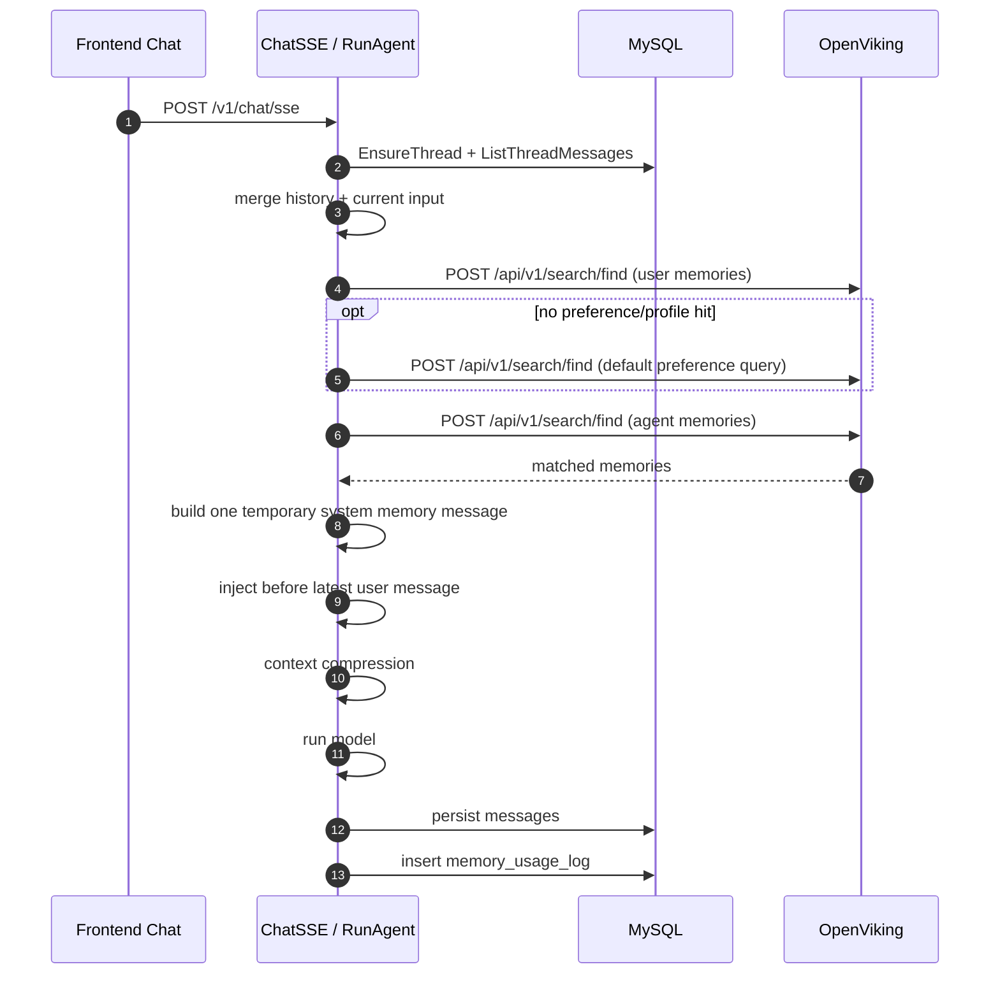
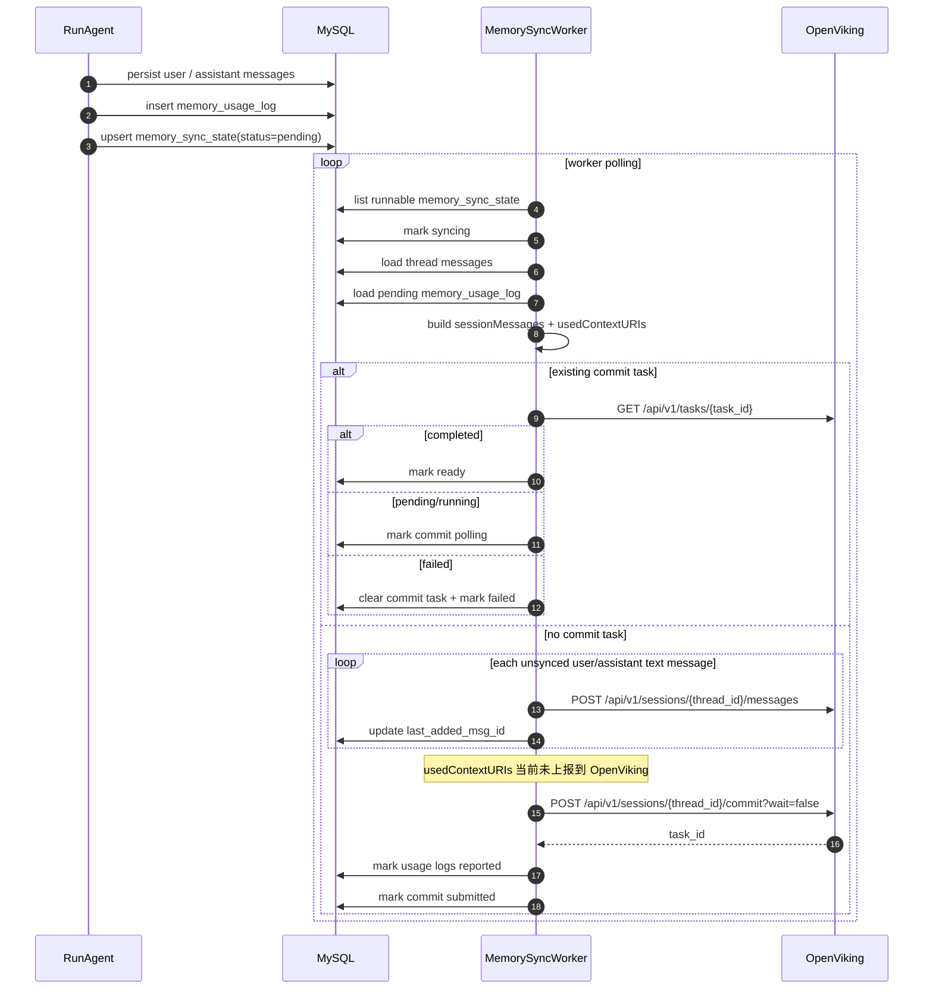

## 结论先行

当前项目里“长期记忆”的主实现链路，已经明确分成两段：
1. 读链路：聊天开始前，从 OpenViking 检索长期记忆，拼成一条临时 `system` 消息注入到本轮 prompt。
2. 写链路：聊天结束后，把本轮新增的用户/助手消息异步同步到 OpenViking Session，再调用 `commit` 触发记忆提取。
需要先明确几个边界：
- 当前长期记忆主链是 **OpenViking 驱动**，不是本地 `rag/milvus` 服务驱动。
- 前端 **不直接读写长期记忆**，只负责发起聊天、展示消息历史；长期记忆的检索与沉淀都在后端。
- 当前项目里“上下文压缩摘要”是本地线程级摘要，不等同于长期记忆。
- 当前代码已经记录“本轮用了哪些长期记忆 URI”，但 **还没有真正调用 OpenViking 的 `session.used(...)` / `/used` 接口** 把这些 usage 上报进去。

todo：

当前的链路主要是：记忆检索 -> 返回 URI -> 本地落 memory_usage_log -> worker 取出 URI

理论上下一步还有： worker -> OpenViking session.used(contexts=[...]) -> commit

## 参与模块
### 前端

- `openIntern_forentend/app/(workspace)/chat/page.semi.tsx`
- 负责生成/切换 `threadId`
- 拉取线程历史消息
- 发起 `agent.runAgent(...)`
- `openIntern_forentend/app/api/backend/[...path]/route.ts`
- 把前端 `/api/backend/*` 代理到后端 `API_BASE_URL`
### 后端

- `openIntern_backend/internal/controllers/chat.go`
- `POST /v1/chat/sse` 的入口
- `openIntern_backend/internal/services/agent/agent_entry.go`
- 一轮聊天执行主流程
- `openIntern_backend/internal/services/memory_retriever.go`
- 长期记忆检索与 prompt 注入
- `openIntern_backend/internal/services/memory_sync_worker.go`
- 长期记忆异步同步 worker
- `openIntern_backend/internal/services/memory_sync_state.go`
- 同步状态管理
- `openIntern_backend/internal/services/memory_usage_log.go`
- 本轮注入的记忆 URI 使用记录
### DAO / 存储
- `openIntern_backend/internal/dao/memory_search.go`
- 调 OpenViking `/api/v1/search/find`
- `openIntern_backend/internal/dao/openviking_session.go`
- 调 OpenViking Session API
- `openIntern_backend/internal/models/message.go`
- 对话消息表
- `openIntern_backend/internal/models/memory_sync_state.go`
- 长期记忆同步状态表
- `openIntern_backend/internal/models/memory_usage_log.go`
- 长期记忆使用日志表
- `openIntern_backend/internal/models/thread_context_snapshot.go`
- 本地上下文压缩快照表
### 外部系统
- OpenViking
- 负责长期记忆检索
- 负责 Session commit 后的记忆提取
- MySQL
- 保存聊天消息、同步状态、使用日志、压缩摘要
- Redis
- 仅用于线程/消息列表缓存，不承载长期记忆本体
---
## 启动期初始化

后端启动时会做这几件与长期记忆有关的初始化：
1. `database.InitContextStore(cfg.Tools.OpenViking)`
- 初始化 OpenViking HTTP 客户端
2. `services.InitMemoryRetriever(cfg.Tools.OpenViking)`
- 设置检索超时
3. `services.InitMemorySync(cfg.Tools.OpenViking)`
- 启动内存里的异步 worker，轮询待同步线程
对应代码：
- `openIntern_backend/main.go`
- `openIntern_backend/internal/database/context_store.go`
- `openIntern_backend/internal/config/config.go`
说明：
- 如果 `tools.openviking` 没配好，长期记忆能力会直接降级。
- `main.go` 里虽然也初始化了 `embedding` 和 `rag.InitRAG(cfg.Milvus)`，但当前聊天长期记忆主链 **没有直接走本地 `rag` 服务**。
---
## 读链路：聊天前检索长期记忆并注入 prompt
### 前端发起聊天
前端聊天页会：
1. 生成或读取 `threadId`
2. 先通过 `/api/backend/v1/threads/{threadId}/messages` 拉历史消息
3. 调 `agent.runAgent(...)` 发起本轮请求
这部分只决定“本轮传什么消息、线程号是多少”，不在前端做长期记忆检索。
### 请求进入后端 SSE
后端入口：
- 路由：`POST /v1/chat/sse`
- 控制器：`controllers.ChatSSE`
入口逻辑：
1. 绑定 `RunAgentInput`
2. 如果没传 `thread_id` 就生成一个
3. 校验登录态
4. `services.Thread.EnsureThread(...)` 确保线程存在
5. 调 `services.RunAgent(...)`
### RunAgent 主流程里插入长期记忆

`RunAgent` 的顺序很关键：
1. 先从 MySQL 取本线程历史消息
2. 把历史消息和本次输入合并
3. 处理 forwarded props
4. 调 `injectRetrievedMemoryContext(...)`
5. 再做上下文压缩
6. 再进入模型执行
也就是说，**长期记忆注入发生在上下文压缩之前**。
### 检索逻辑

`MemoryRetriever.BuildMemoryContext(...)` 的行为：
1. 从当前 `RunAgentInput.Messages` 里，倒序找最后一条 user 消息
2. 用这条 user 文本作为 query
3. 调 OpenViking `POST /api/v1/search/find`
检索目标固定为两个根：
- 用户记忆根：`viking://user/default/memories/`
- Agent 记忆根：`viking://agent/default/memories/`
检索策略：
1. 先查 user memories，`limit=4`
2. 再查 agent memories，`limit=2`
3. 分别按分数降序
4. user 结果排在 agent 结果前
5. 去重 URI
6. 最终最多取 5 条
过滤规则：
- `score_threshold = 0.4`
- 只保留目标根下面的 URI
- 仅把 `Abstract` 注入 prompt，不把 URI、类型等检索元数据暴露给模型
### 注入形式
注入结果不是结构化上下文对象，而是一条临时 `system` 消息，格式大致是：
```text
以下是与当前请求相关的长期记忆，仅在确实相关时参考；若与用户当前明确要求冲突，以当前要求为准：
1. ...
2. ...
```
然后这条 `system` 消息会被插入到“最后一条 user 消息之前”。
### 本轮记忆使用记录
检索命中的 URI 会被一并返回，等本轮聊天完成后：
1. `recordRetrievedMemoryUsage(...)`
2. 写入 `memory_usage_log`
这一步记录的是：
- 哪个 `thread_id`
- 哪个 `run_id`
- 实际注入了哪些 `memory_uri`
它的目标是为后续“把 used memory usage 也同步给 OpenViking”做准备。
### 读链路时序图

---
## 写链路：聊天后异步提交 Session 触发记忆提取
### 聊天结束后的本地落库
`RunAgent` 执行完后，后端会顺序做这些事：
1. `persistUserLastMessage(...)`
- 保存本轮最后一条 user 消息
2. `persistAccumulatedMessages(...)`
- 保存本轮流式产出的 assistant/tool/activity 等 AG-UI 消息
3. `Thread.TouchThread(...)`
4. `recordRetrievedMemoryUsage(...)`
5. `scheduleThreadMemorySync(...)`
这里最关键的是第 5 步：把线程标记为“待同步长期记忆”。
### memory_sync_state 的作用

`memory_sync_state` 是线程级同步游标表，用来保证：
- 哪些消息已经 add 到 OpenViking Session
- 哪些消息已经 commit 成功
- 当前是否在同步
- 失败后何时重试
核心字段：
- `thread_id`
- `last_added_msg_id`
- `last_synced_msg_id`
- `last_committed_run_id`
- `commit_task_id`
- `commit_task_status`
- `commit_status`
- `status`
- `retry_count`
- `next_attempt_at`
状态语义：
- `status`
- `pending`
- `syncing`
- `ready`
- `failed`
- `commit_status`
- `pending`
- `processing`
- `committed`
- `failed`
### worker 如何启动

`InitMemorySync(...)` 在进程里起一个 goroutine：
- 默认每 3 秒轮询一次
- 每次最多处理 10 个线程
这意味着当前长期记忆同步是 **单进程内 worker**，不是独立任务系统。
### worker 如何挑任务

`ProcessPendingMemorySyncStates(...)` 会：
1. 查出 `status in (pending, failed)` 且 `next_attempt_at <= now` 的线程
2. 先调用 `MarkSyncing(thread_id)` 抢占
3. 成功后进入 `syncThreadMemoryState(...)`
### 把本地消息增量同步到 OpenViking Session

`syncThreadMemoryState(...)` 的核心逻辑：
1. 读出本线程所有消息
2. 读出尚未 `reported_at` 的 `memory_usage_log`
3. 根据 `last_added_msg_id` / `last_synced_msg_id` 算本次增量消息范围
4. 把增量消息转成 `sessionSyncMessage`
5. 用 `thread_id` 直接作为 OpenViking `session_id`
要注意，当前真正会同步到 OpenViking 的消息只有：
- `role = user`
- `role = assistant`
以下内容不会同步进 OpenViking Session：
- `tool_result`
- `tool_call`
- `reasoning_message`
- `activity`
- `system`
- 非文本附件本体
原因是 `buildSessionSyncMessage(...)` 最终只提取纯文本 user/assistant 消息。
### OpenViking Session 提交步骤

当前代码实际调用链是：
1. `POST /api/v1/sessions/{thread_id}/messages`
- 按增量逐条追加 user/assistant 文本消息
2. `POST /api/v1/sessions/{thread_id}/commit?wait=false`
- 异步提交
3. `GET /api/v1/tasks/{task_id}`
- 轮询任务状态
提交被接受后：
1. 本地把对应 usage log 标记为 `reported_at`
2. `memory_sync_state` 写入 `commit_task_id`
3. 后续轮询 task
轮询结果：
- `pending/running`
- `MarkCommitPolling(...)`
- `completed`
- `MarkReady(...)`
- `last_synced_msg_id = last_added_msg_id`
- `failed`
- 清理 task 信息并进入 failed
### 当前“used contexts”链路的真实现状

当前代码里已经有：
1. 读链路收集注入过的 `memory_uri`
2. 本轮结束后写入 `memory_usage_log`
3. worker 取出待上报 usage logs，聚合成 `usedContextURIs`
但是到这里就停了。
`syncThreadMemoryState(...)` 里虽然算出了：
- `usedContextURIs`
- `usageLogIDs`
但当前没有任何一步调用：
- OpenViking `session.used(...)`
- 或类似 `/api/v1/sessions/{id}/used`
也就是说：
- **“哪些长期记忆被用过”目前只在本地 MySQL 有记录**
- **并没有真正同步到 OpenViking Session usage_records**
### 写链路时序图（按当前真实代码）

---
## 本地数据落点
### `message`
用途：
- 保存前端/模型交互产生的 AG-UI 消息
- 作为后续同步到 OpenViking Session 的事实来源
特点：
- `content` 存的是 AG-UI Message JSON
- worker 在同步时会再次反序列化
### `memory_sync_state`
用途：
- 线程级同步游标
- 失败重试状态
- OpenViking commit task 跟踪
### `memory_usage_log`
用途：
- 记录“本轮实际注入过哪些长期记忆 URI”
- 当前主要还是本地审计/准备上报用途
### `thread_context_snapshot`
用途：
- 线程上下文压缩快照
- 保存压缩摘要
注意：
- 这不是 OpenViking 长期记忆
- 这是本地会话级摘要，用来减少 prompt token
---
## 当前链路中的几个关键事实
### 当前长期记忆检索是固定根，不是按登录用户动态隔离
`memory_search.go` 里写死了：
- `viking://user/default/memories/`
- `viking://agent/default/memories/`
当前没有看到按 `user_id`、`thread_id`、租户信息去拼不同 memory root 的逻辑。
这意味着从代码现状看，长期记忆命名空间仍是固定 default 根。
### 检索 query 只取最后一条 user 文本
当前不会综合：
- 更长对话上下文
- 工具结果
- 上下文压缩摘要
- 选中的知识库/技能
来构造 memory query，而是直接拿最后一条 user 文本。
### 注入的是摘要，不是原始记忆全文
注入 prompt 时只用 OpenViking 返回的 `Abstract`，这有两个作用：
- 减少 prompt 体积
- 避免把内部 URI、类型等检索元信息暴露给模型
### OpenViking Session ID 与 thread_id 绑定
当前没有单独创建 session 并保存 session_id。
代码约定：
- `session_id = thread_id`
worker 后续所有 `/sessions/{id}/...` 调用都直接复用这个 thread 级 ID。
### 本地 `rag/milvus` 目前不在长期记忆主链上
仓库里有：
- `internal/services/embedding`
- `internal/services/rag`
但从聊天入口到长期记忆检索/提交这条链来看，真正调用的是：
- OpenViking `search/find`
- OpenViking `sessions/{id}/messages`
- OpenViking `sessions/{id}/commit`
- OpenViking `tasks/{id}`
所以当前长期记忆实现应理解为 **OpenViking 方案**，不是本地 RAG 方案。
---
## 与“上下文压缩”的关系
这两套能力很容易混淆，当前应分开理解：
### 长期记忆
- 外部存储：OpenViking
- 生命周期：跨线程/跨会话沉淀
- 进入 prompt 的方式：检索后注入临时 `system` 消息
### 上下文压缩
- 本地存储：MySQL `thread_context_snapshot`
- 生命周期：线程内滚动摘要
- 目标：在 token 超预算时保留上下文连续性
顺序上是：
1. 先注入长期记忆
2. 再做上下文压缩
3. 再送模型
所以压缩器处理的是“历史消息 + 临时记忆 system 消息”组成后的上下文。
---
## 当前链路缺口 / 风险点
### `usedContextURIs` 没有真正上报到 OpenViking
这是当前最明显的链路缺口。
影响：
- OpenViking Session 内的 usage_records 可能不完整
- 后续如果依赖“使用过哪些上下文”做更精确的记忆提取/迭代，当前实现是断的
### 非文本与工具执行信息不会进入 Session commit
当前只同步 user/assistant 文本。
影响：
- 工具执行结果
- reasoning 过程
- activity 事件
- 多模态附件内容
都不会成为 OpenViking commit 的直接输入。
### 检索命名空间固定为 default
如果未来要支持真正的多用户隔离，当前 memory root 固定值需要改造。
### Session 创建假设依赖 OpenViking 服务端行为
当前没有显式“create session”步骤，而是直接：
- `add_message`
- `commit`
这要求 OpenViking 服务端允许基于既定 `session_id` 直接操作或隐式创建。
---
## 建议的理解方式
如果只用一句话概括当前实现，可以理解成：
> openIntern 现在的长期记忆，是“本地线程消息落 MySQL + OpenViking 检索注入 + OpenViking Session 异步 commit 提取”的双向链路；其中读链路已可工作，写链路主体已可工作，但 `used contexts` 上报这半段还没有真正接上。
---
## 关键文件索引
- 前端聊天入口：`openIntern_forentend/app/(workspace)/chat/page.semi.tsx`
- 前端后端代理：`openIntern_forentend/app/api/backend/[...path]/route.ts`
- 聊天路由：`openIntern_backend/internal/routers/router.go`
- 聊天控制器：`openIntern_backend/internal/controllers/chat.go`
- Agent 主流程：`openIntern_backend/internal/services/agent/agent_entry.go`
- 长期记忆注入：`openIntern_backend/internal/services/memory_retriever.go`
- 长期记忆检索 DAO：`openIntern_backend/internal/dao/memory_search.go`
- OpenViking Session DAO：`openIntern_backend/internal/dao/openviking_session.go`
- 同步 worker：`openIntern_backend/internal/services/memory_sync_worker.go`
- 同步状态 service：`openIntern_backend/internal/services/memory_sync_state.go`
- 使用日志 service：`openIntern_backend/internal/services/memory_usage_log.go`
- 消息模型：`openIntern_backend/internal/models/message.go`
- 同步状态模型：`openIntern_backend/internal/models/memory_sync_state.go`
- 使用日志模型：`openIntern_backend/internal/models/memory_usage_log.go`
- 压缩摘要模型：`openIntern_backend/internal/models/thread_context_snapshot.go`
- 旧版流程图（与现状有偏差）：`开发文档/长期记忆/v1版session同步到openviking提取记忆流程.md`
