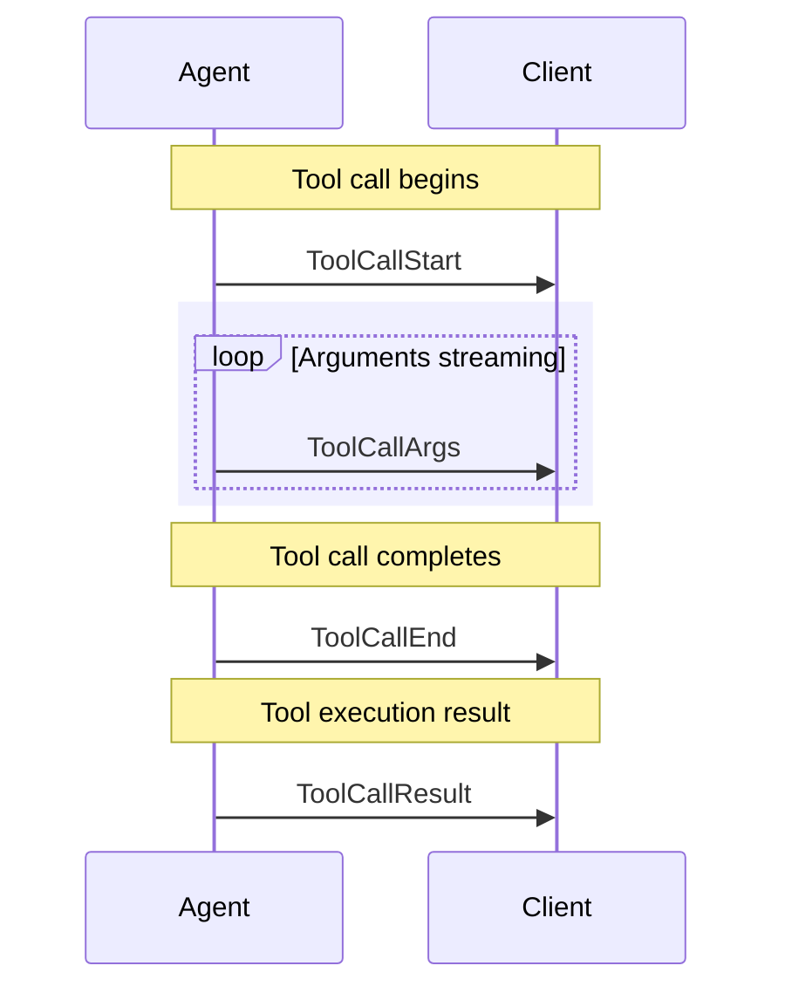

# 需求背景

完成chat页面对于消息的通信以及信息渲染。

数据来源：
1. 通过会话id,即thread_id拉取的历史消息，接口为：Get的 /:thread_id/messages
2. 通过SSE返回AGUI协议的实时事件流，需要实时渲染Text信息、tool call 信息、reasoning 信息以及特殊的activity事件（type 为a2ui-surface的话需要特殊处理->合适的渲染组件）

# 分级处理

thread_id 是最上一级，代表一次chat对话的会话id，每个会话id下会有多个消息。

run_id 表示一次chat对话的运行id，每个运行id可以有多个处理消息，包括用户消息、assistant消息、tool call消息、reasoning消息等。 这个对应到最终的SemiMessage[]中的一项的id

msg_id 是每个消息的唯一标识，每个消息在数据库中都有一个唯一的msg_id。注意在实时的SSE渲染中，各类事件对于消息的标识名称不一定一致。这里和前端SemiMessage[]的关系是，对于一个SemiMessage项，下面会有一个content, 可以是ContentItem[],而msg_id就是这个ContentItem的id字段。

# 不同的进入方式

前端有两个选项，第一个是新建对话，可以建立一个全新的对话，此时后台中没有该thread_id的消息，第二个就是点击已有的历史对话，他会根据thread_id拉取该会话的历史消息。

加载完历史消息后，用户输入问题，点击发送后，会回显用户的问题在chat页面中，并发送给后端的Agent系统，后台处理发送AGUI协议的SSE流，前端接收SSE事件，然后进行渲染处理。

# 一次chat对话细节

todo

# 后端数据响应

## 历史消息返回格式

```go
{
    []models.Message `json:"items"`
	Total int64       `json:"total"`
}

```

每一个数据项为：
```go
type Message struct {
	ID       uint   `gorm:"primarykey" json:"-"`
	MsgID    string `gorm:"column:msg_id;uniqueIndex;not null;size:64" json:"msg_id"`
	ThreadID string `gorm:"index;not null;size:64" json:"thread_id"`
	RunID    string `gorm:"index;not null;size:64" json:"run_id"`

	Type     string `gorm:"size:20" json:"type"`  // 和https://docs.ag-ui.com/concepts/messages 所拥有的类型是一样的
	Content  string `gorm:"type:text;not null" json:"content"` // 这里面存放的是AGUI的消息结构体：https://docs.ag-ui.com/concepts/messages
	Status   string `gorm:"size:20" json:"status"` 
	Metadata string `gorm:"type:text" json:"metadata"`

	CreatedAt time.Time `json:"created_at"`
	UpdatedAt time.Time `json:"updated_at"`
	DeletedAt gorm.DeletedAt `gorm:"index" json:"-"`
}
```

具体的消息内容是content, 这个content是在一次chat对话中，不断累积的AGUI协议的消息结构体，可以在openIntern/go/pkg/core/types/types.go 的 Message结构体定义中找到：

```go
// Message represents an AG-UI message.
type Message struct {
	// ID is the message identifier.
	ID string `json:"id"`
	// Role is the message role discriminator.
	Role Role `json:"role"`
	// Content is the message content (string, []InputContent, or structured object depending on role).
	Content any `json:"content,omitempty"`
	// Name is an optional sender name.
	Name string `json:"name,omitempty"`
	// ToolCalls is an optional list of tool calls associated with an assistant message.
	ToolCalls []ToolCall `json:"toolCalls,omitempty"`
	// ToolCallID is an optional tool call identifier associated with a tool message.
	ToolCallID string `json:"toolCallId,omitempty"`
	// Error is an optional error message for tool messages.
	Error string `json:"error,omitempty"`
	// ActivityType is an optional activity discriminator for activity messages.
	ActivityType string `json:"activityType,omitempty"`
	EncryptedContent string `json:"encryptedContent,omitempty"`
	EncryptedValue   string `json:"encryptedValue,omitempty"`
}
```

对于AGUI相关的消息结构体，可以看见： https://docs.ag-ui.com/concepts/messages

比如type = tool_call 的消息content为：

```json
{
    "id": "call_aym7tfwvyt384m8ovnfq530u",
    "role": "assistant",
    "toolCalls": [
        {
            "id": "call_aym7tfwvyt384m8ovnfq530u",
            "type": "function",
            "function": {
                "name": "sandbox_execute_bash",
                "arguments": "{\"cmd\": \"date\"}"
            }
        }
    ]
}
```

type = tool_result 的消息content为：

```json
{
    "id": "d0ca5657-3c2c-4a06-9337-6bcd4d60c923",
    "role": "tool",
    "content": "{\"content\":[{\"type\":\"text\",\"text\":\"{\\\"status\\\":\\\"completed\\\",\\\"output\\\":\\\"\\\",\\\"exit_code\\\":0}\"}],\"structuredContent\":{\"exit_code\":0,\"output\":\"\",\"status\":\"completed\"}}",
    "toolCallId": "call_aym7tfwvyt384m8ovnfq530u"
}
```

type = text的信息content为：

```json
{
    "id": "0cd730c4-6237-468a-8716-5a4fc631c2fb",
    "role": "user",
    "content": "你可以做什么"
}
```
其中，这里的role可以为assistant, 也可以为user

type = activity 且"activityType": "a2ui-surface"的消息content为：
这个需要专门的a2ui消息渲染器来进行渲染

```json
{
    "id": "welcome_msg_001",
    "role": "activity",
    "content": {
        "operations": [
            {
                "surfaceUpdate": {
                    "components": [
                        {
                            "component": {
                                "Card": {
                                    "child": "content"
                                }
                            },
                            "id": "root"
                        },
                        {
                            "component": {
                                "Column": {
                                    "alignment": "center",
                                    "children": {
                                        "explicitList": [
                                            "welcomeText"
                                        ]
                                    },
                                    "distribution": "center"
                                }
                            },
                            "id": "content"
                        },
                        {
                            "component": {
                                "Text": {
                                    "text": {
                                        "literalString": "welcome to use openIntern"
                                    },
                                    "usageHint": "h2"
                                }
                            },
                            "id": "welcomeText"
                        }
                    ],
                    "surfaceId": "default"
                }
            },
            {
                "beginRendering": {
                    "root": "root",
                    "surfaceId": "default"
                }
            }
        ]
    },
    "activityType": "a2ui-surface"
}
```

TODO: reasoning类消息的存储格式

## 通过SSE返回的AGUI协议信息

AGUI是一种基于事件驱动的协议，用于在前端和后端Agent系统之间进行通信。

各种事件类型：https://docs.ag-ui.com/concepts/events

agent系统的每一次运行都会以RUN_STARTED事件开始，以RUN_FINISHED事件结束。 其中带有的run_id就是这一次运行的唯一标识。 
```txt
data: {"type":"RUN_STARTED","timestamp":1771513529217,"threadId":"2d3c4039-67d8-4d38-98b2-ea0975ff1632","runId":"run-115f6131-4592-4ee2-9b62-7181f54dbdba","input":{"threadId":"2d3c4039-67d8-4d38-98b2-ea0975ff1632","runId":"550a34fe-6484-46bd-aef8-0348e934ec40","state":{},"messages":[{"id":"ed9a32a2-3523-4a8d-be9e-9d5c01283b4d","role":"user","content":"使用A2UI发送欢迎卡片"}],"tools":[],"context":[],"forwardedProps":{}}}

... 其他信息流

data: {"type":"RUN_FINISHED","timestamp":1771513547409,"threadId":"2d3c4039-67d8-4d38-98b2-ea0975ff1632","runId":"run-115f6131-4592-4ee2-9b62-7181f54dbdba"}
```

其他事件是不带有run_id的。但是和RUN_STARTED, RUN_FINISHED事件都在一个SSE流中，通过提前记录run_id，后续的事件都可以关联到这一次运行。

对于Text Message events，如下所示，可以看到，其通过TEXT_MESSAGE_START标识开始，TEXT_MESSAGE_CONTENT标识内容，TEXT_MESSAGE_END标识结束。同时其发送增量信息，通过messageId字段可以标识其属于同一条text中的消息
```txt
data: {"type":"TEXT_MESSAGE_START","timestamp":1771513547162,"messageId":"msg-0eb61eb1-841a-44e0-a060-3d236028c7a8","role":"assistant"}

data: {"type":"TEXT_MESSAGE_CONTENT","timestamp":1771513547162,"messageId":"msg-0eb61eb1-841a-44e0-a060-3d236028c7a8","delta":"已"}

data: {"type":"TEXT_MESSAGE_CONTENT","timestamp":1771513547162,"messageId":"msg-0eb61eb1-841a-44e0-a060-3d236028c7a8","delta":"成功"}

...

data: {"type":"TEXT_MESSAGE_CONTENT","timestamp":1771513547409,"messageId":"msg-0eb61eb1-841a-44e0-a060-3d236028c7a8","delta":"~"}

data: {"type":"TEXT_MESSAGE_END","timestamp":1771513547409,"messageId":"msg-0eb61eb1-841a-44e0-a060-3d236028c7a8"}
```

对于Tool 类消息



# 技术方案

## 前端渲染组件

前端的AI聊天界面和输入框主要使用semi design的 https://semi.design/zh-CN/ai/aiChatDialogue 和 https://semi.design/zh-CN/ai/aiChatInput

特殊：对于activity类型的a2ui-surface消息，需要使用createA2UIMessageRenderer渲染器来进行渲染

比如一种使用方式为：
```ts
import { createA2UIMessageRenderer } from "@copilotkit/a2ui-renderer";
import { theme } from "../../theme";

const A2UIMessageRenderer = createA2UIMessageRenderer({ theme });

const ActivityRenderer = A2UIMessageRenderer.render;

<div className="rounded-xl border bg-white p-4">
<ActivityRenderer
    activityType={activityType}
    content={content}
    message={message}
    agent={agent}
/>
</div>

```

## 前端和后端Agent系统通信

使用copliotkit框架来连接前端和后端Agent系统，并且暴露出消息给semi-design使用

这里推荐使用useAgent hook： https://docs.copilotkit.ai/reference/v2/hooks/useAgent

他会返回一个AG-UI AbstractAgent instance（https://docs.ag-ui.com/sdk/js/client/abstract-agent）

- AG‑UI 事件 ：通过 subscribe 回调拿到（原始事件流）
- AG‑UI 消息 ：通过 agent.messages 拿到（聚合后的消息态）

## run_id和消息的映射关系

一个run_id下的消息，可能有tool, text以及推理之类的多条消息，应该映射到同一个content中，
同时注意，这里消息的id可以使用run_id, 可以看到content项没有时间或者优先级排序，所以对于实时渲染就追加就行，而历史消息中，同一个run_id的消息有更新时间的，可以根据这个时间来排序。

```ts
const defaultMessages = [
    {
        role: 'assistant',
        id: '1',
        createAt: 1715676751919,
        content: '普通文本', 
    },
    {
        id: '2',
        role: 'user',
        content: [
            {
                type: 'message',
                content: [
                    {
                        type: 'input_text',
                        text: '帮我生成类似的图片',
                    },
                    {
                        type: 'input_image',
                        image_url: 'https://lf3-static.bytednsdoc.com/obj/eden-cn/ptlz_zlp/ljhwZthlaukjlkulzlp/root-web-sites/edit-bag.jpeg',
                        file_id: 'demo-file-id'
                    },
                    {
                        type: 'input_text',
                        text: '以下是文件展示',
                    },
                    {
                        type: 'input_file',
                        file_url: 'https://www.semi.pdf',
                        filename: 'semi.pdf',
                        size: '100KB',
                    },
                    {
                        type: 'input_file',
                        file_url: 'https://www.semi.json',
                        filename: 'semi.json',
                        size: '100KB',
                    },
                    {
                        type: 'input_file',
                        file_url: 'https://www.semi.docx',
                        filename: 'semi.docx',
                        size: '100KB',
                    }
                ],
            },
        ],
        status: 'completed',
    },
    {
        id: '3',
        role: 'assistant',
        content: [
            {
                type: 'reasoning',
                status: 'completed',
                summary: [
                    {
                        'type': 'summary_text',
                        'text': '\n我需要思考并回答用户关于什么是 Semi 组件库的问题...'
                    }
                ],
            },
            {
                type: 'message',
                content: [
                    {
                        type: 'output_text',
                        text: 'Semi Design 是由抖音前端团队和MED产品设计团队设计、开发并维护的设计系统。'
                    }
                ],
                status: 'completed',
            },
            {
                id: 'fc_12345xyz',
                call_id: 'call_12345xyz',
                type: 'function_call',
                name: 'get_weather',
                status: 'completed',
                arguments: '{\'location\':\'Paris, France\'}'
            },
            {
                type: 'message',
                content: [
                    {
                        type: 'output_text',
                        text: '恭喜你，你已经掌握了 semi design 的所有知识！',
                        annotations: [
                            {
                                title: 'semi.design',
                                url: 'https://semi.design/',
                                detail: 'semi design page',
                                logo: 'https://lf3-static.bytednsdoc.com/obj/eden-cn/ptlz_zlp/ljhwZthlaukjlkulzlp/other/logo.png'
                            },
                            {
                                title: 'semi.design',
                                url: 'https://semi.design/',
                                detail: 'semi design page',
                                logo: 'https://lf3-static.bytednsdoc.com/obj/eden-cn/ptlz_zlp/ljhwZthlaukjlkulzlp/other/logo.png'
                            },
                        ]
                    }
                ]
            },
            {
                type: 'plan',
                content: [
                    {
                        summary: '创建一份全面的北京旅游攻略，包含景点、住宿、交通、美食和实用旅行建议',
                        steps: [
                            {
                                summary: '搜索北京旅游景点介绍及门票信息',
                                description: '正在搜索: 北京旅游景点介绍及门票信息',
                                type: 'search',
                            }, 
                            {
                                summary: '读取指定文件的指定行内容',
                                description: '正在创建文档:  北京旅游攻略',
                                type: 'docs',
                            }, 
                            {
                                summary: '创建包含北京旅游攻略的文件',
                                description: '正在创建代码文件: beijing_travel_guide.html',
                                type: 'code',
                            }, 
                        ],
                        statues: 'completed'
                    },
                    {
                        summary: '总结北京旅游攻略的创建成果并呈现给用户',
                        steps: []
                    }
                ],
            }
        ],
        status: 'completed',
    },
];

```

## 使用useAgent的什么方法来和前端消息数据进行同步？

### 不使用useAgent的messages，而是走订阅AGUI消息

对于runAgent方法

```ts
runAgent(parameters?: RunAgentParameters, subscriber?: AgentSubscriber): Promise<RunAgentResult>

```

其中
```ts
interface RunAgentParameters {
  runId?: string // Unique ID for this execution run
  tools?: Tool[] // Available tools for the agent
  context?: Context[] // Contextual information
  forwardedProps?: Record<string, any> // Additional properties to forward
}
```

The optional subscriber parameter allows you to provide an AgentSubscriber for handling events during this specific run.

```ts
interface RunAgentResult {
  result: any // The final result returned by the agent
  newMessages: Message[] // New messages added during this run
}
```

对于runAgent的方法，他会将本身的messages对象全部发给后端。

但是现在的后端实现中，会直接从数据库中拿历史消息，那么如果通过messages和semidesign的消息数组同步，每次对话就会带上全量的消息，但是增量消息的发送其实更加节省带宽。

这个错误的，在0.0.45版本中没找到：走完全事件订阅的是：在再一次agent的run中，有一个`events$: Observable<BaseEvent>` https://docs.ag-ui.com/sdk/js/client/abstract-agent#observable-properties, 表示可观测的AGUI事件流，通过订阅这个事件流。将获得的事件，直接将数据映射到一个Message的某个ContentItem中

使用subscribe来进行处理

### 使用messages数组，copliotkit直接处理事件

useAgent方法会返回一个AbstractAgent实例：https://docs.ag-ui.com/sdk/js/client/abstract-agent

其runAgent方法会返回一个Promise，当Promise resolve时，会返回一个RunAgentResult对象，其中包含了newMessages数组，这个数组就是增量消息数组。

将这里的消息按照时间的顺序同步追加转换到前端的SemiMessage[]的content中：

ContentItem[]中做好和AGUI消息类型的转换即可
```ts
export interface Message {
    id: string;
    content?: string | ContentItem[];
    output_text?: string;
    role: string;
    name?: string;
    createdAt?: number;
    updatedAt?: number;
    model?: string;
    status?: string;
    [x: string]: any;
}

export type ContentItem = InputContentItem | OutputContentItem;
export type InputContentItem = InputMessage | ItemReference;
export type OutputContentItem = OutputMessage | ToolCallContentItem | MCPContentItem | Reasoning;
export type ToolCallContentItem = FileSearchToolCall | WebSearchToolCall | FunctionToolCall | CustomToolCall | ImageGenerationCall | CustomObject;
export type MCPContentItem = MCPToolCall;

```
这是错误的，最新的0.0.45版本没找到：同时注意，再一次agent的run中，有一个`events$: Observable<BaseEvent>` https://docs.ag-ui.com/sdk/js/client/abstract-agent#observable-properties, 表示可观测的AGUI事件流，通过订阅这个事件流，可以拿到RUN_STARTED和RUN_END事件中的run_id, 这个run_id填入semiMessage中的id中，标识这个Message是属于哪个run的。所有的ContentItem[]都属于这个run_id。

使用subscribe来进行处理
