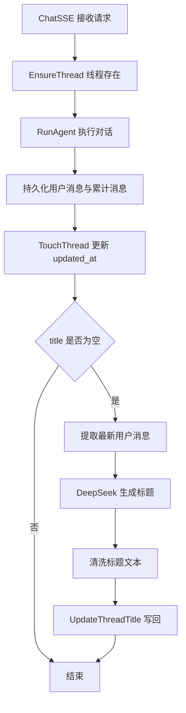

# 消息总结流程

## 背景与目的
历史会话列表需要可读标题，而不是 thread_id。当前做法是基于用户消息生成简短标题，并保存到 thread.title，让前端列表直接展示。

## 触发入口
- ChatSSE 接口收到请求后确保线程存在
- RunAgent 执行对话与消息落库
- RunAgent 完成后触发标题生成与写回

## 生成逻辑
- 仅当 thread.title 为空时生成
- 取最新一条用户消息作为摘要输入
- 使用 DeepSeek 模型生成不超过 20 字标题
- 清洗标题文本并写回数据库

## Mermaid 主流程

## 关键点与边界
- 未配置 summary_llm 时不生成标题，保持原流程
- 用户手动重命名优先，后续不会覆盖已有 title
- 标题生成失败不影响主对话流程
