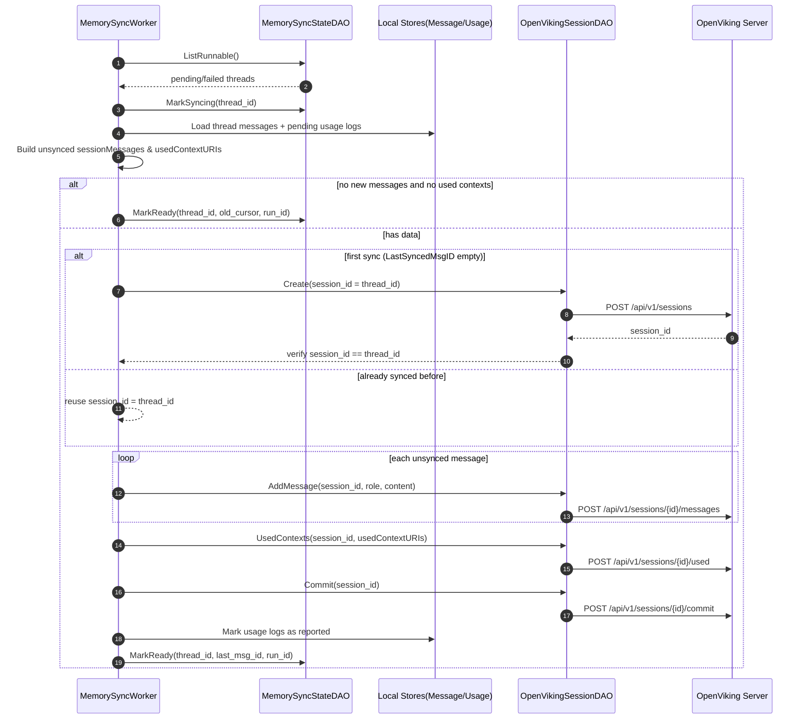

```mermaid
sequenceDiagram
  autonumber
  participant W as MemorySyncWorker
  participant S as MemorySyncStateDAO
  participant L as Local Stores(Message/Usage)
  participant O as OpenVikingSessionDAO
  participant V as OpenViking Server

  W->>S: ListRunnable()
  S-->>W: pending/failed threads
  W->>S: MarkSyncing(thread_id)

  W->>L: Load thread messages + pending usage logs
  W->>W: Build unsynced sessionMessages & usedContextURIs

  alt no new messages and no used contexts
    W->>S: MarkReady(thread_id, old_cursor, run_id)
  else has data
    alt first sync (LastSyncedMsgID empty)
      W->>O: Create(session_id = thread_id)
      O->>V: POST /api/v1/sessions
      V-->>O: session_id
      O-->>W: verify session_id == thread_id
    else already synced before
      W-->>W: reuse session_id = thread_id
    end

    loop each unsynced message
      W->>O: AddMessage(session_id, role, content)
      O->>V: POST /api/v1/sessions/{id}/messages
    end

    W->>O: UsedContexts(session_id, usedContextURIs)
    O->>V: POST /api/v1/sessions/{id}/used

    W->>O: Commit(session_id)
    O->>V: POST /api/v1/sessions/{id}/commit

    W->>L: Mark usage logs as reported
    W->>S: MarkReady(thread_id, last_msg_id, run_id)
  end

```